# TaskFlow

A microservices-based task management application.

## Architecture

This project consists of multiple microservices with a modern microservices architecture:

### System Architecture Diagram

```mermaid
graph TB
    %% External Layer
    User[👤 User]
    
    %% Load Balancer / Proxy Layer
    LB[🌐 Nginx Load Balancer<br/>Port 8000]
    
    %% Frontend Layer
    Frontend[⚛️ React Frontend<br/>Port 3000<br/>TypeScript + Tailwind]
    
    %% API Gateway / Service Mesh
    subgraph "API Gateway"
        AuthAPI[🔐 Auth Service<br/>Port 8001<br/>Django + JWT]
        TasksAPI[📋 Tasks Service<br/>Port 8002<br/>Django + CRUD]
        NotificationsAPI[🔔 Notifications Service<br/>Port 8003<br/>FastAPI + Events]
    end
    
    %% Message Queue Layer
    subgraph "Message Queue"
        RabbitMQ[🐰 RabbitMQ<br/>Port 5672<br/>Event Streaming]
    end
    
    %% Data Layer
    subgraph "Data Storage"
        PostgreSQL[(🐘 PostgreSQL<br/>Port 5432<br/>Primary Database)]
        Redis[(🔴 Redis<br/>Port 6379<br/>Cache + Sessions)]
    end
    
    %% Infrastructure Layer
    subgraph "Infrastructure"
        K8s[☸️ Kubernetes Cluster<br/>AWS EKS]
        Terraform[🏗️ Terraform<br/>Infrastructure as Code]
    end
    
    %% CI/CD Layer
    subgraph "CI/CD Pipeline"
        GitHub[📦 GitHub Actions<br/>Build & Deploy]
        Docker[🐳 Docker Registry<br/>Container Images]
    end
    
    %% User Flow
    User --> LB
    LB --> Frontend
    Frontend --> AuthAPI
    Frontend --> TasksAPI
    Frontend --> NotificationsAPI
    
    %% Service Communication
    AuthAPI --> PostgreSQL
    AuthAPI --> Redis
    TasksAPI --> PostgreSQL
    TasksAPI --> Redis
    TasksAPI --> RabbitMQ
    NotificationsAPI --> RabbitMQ
    NotificationsAPI --> Redis
    
    %% Event Flow
    TasksAPI -.->|Task Events| RabbitMQ
    RabbitMQ -.->|Process Events| NotificationsAPI
    NotificationsAPI -.->|Store Notifications| Redis
    
    %% Infrastructure
    K8s --> AuthAPI
    K8s --> TasksAPI
    K8s --> NotificationsAPI
    K8s --> Frontend
    K8s --> PostgreSQL
    K8s --> Redis
    K8s --> RabbitMQ
    
    Terraform --> K8s
    GitHub --> Docker
    Docker --> K8s
    
    %% Styling
    classDef frontend fill:#e1f5fe,stroke:#01579b,stroke-width:2px
    classDef backend fill:#f3e5f5,stroke:#4a148c,stroke-width:2px
    classDef database fill:#e8f5e8,stroke:#1b5e20,stroke-width:2px
    classDef infrastructure fill:#fff3e0,stroke:#e65100,stroke-width:2px
    classDef queue fill:#fce4ec,stroke:#880e4f,stroke-width:2px
    
    class Frontend frontend
    class AuthAPI,TasksAPI,NotificationsAPI backend
    class PostgreSQL,Redis database
    class K8s,Terraform,GitHub,Docker infrastructure
    class RabbitMQ queue
```

### Microservices Overview

- **Auth Service**: User authentication and authorization with JWT tokens
- **Tasks Service**: Task management and CRUD operations
- **Notifications Service**: Event-driven notifications and real-time updates
- **Frontend**: React/TypeScript web application with modern UI
- **Proxy**: Nginx reverse proxy with load balancing and security

## Services

### Backend Services
- `auth_service/` - Django-based authentication service
- `tasks_service/` - Django-based task management service
- `notifications_service/` - FastAPI-based notification service

### Frontend
- `frontend/` - React/TypeScript application

### Infrastructure
- `infra/` - Kubernetes and Terraform configurations
- `proxy/` - Nginx configuration

## Getting Started

### Prerequisites
- Docker and Docker Compose
- Node.js 18+ (for frontend development)
- Python 3.11+ (for backend development)

## Development

Use `docker-compose.yml` for local development with all services.
